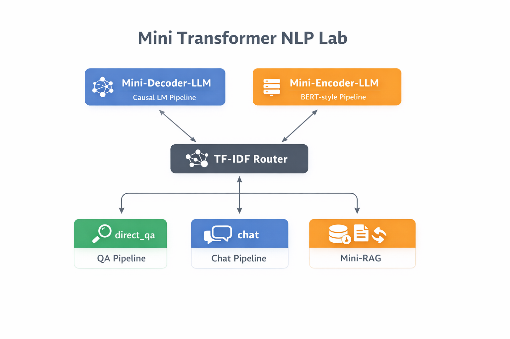

# Mini Transformer NLP Lab

Notebook-first NLP lab for building small transformer systems end-to-end, including model training, task fine-tuning, routing, and retrieval pipelines.

High-level architecture of the Mini Transformer NLP Lab showing the encoder/decoder pipelines, router, and RAG workflow.



- train decoder and encoder models from scratch
- fine-tune for multiple NLP tasks
- train a TF-IDF query router
- build a mini RAG index
- compose everything into a routed mini app

## Quickstart

```bash
python3 -m venv .venv
source .venv/bin/activate
pip install -r requirements.txt
```

```bash
jupyter notebook
```

Open notebooks from the `notebooks/` folder and run cells top-to-bottom.

## Environment

- Python: 3.10+ recommended
- GPU: strongly recommended for pretraining/fine-tuning
- Internet: required when notebooks download Hugging Face datasets/models
- Core deps (from `requirements.txt`): `torch`, `transformers`, `datasets`, `trl`, `tokenizers`, `evaluate`, `numpy`, `matplotlib`

## Project Layout

### `notebooks/Mini-Decoder-LLM/`

Decoder-only track (`LlamaForCausalLM` style).

1. `0. prepare data.ipynb`: stream and clean corpus into `data.txt`
2. `1. train tokenizer.ipynb`: train ByteLevel BPE tokenizer
3. `2. pretrain model from scratch.ipynb`: pretrain base decoder LM into `model/`
4. `3. prepare tokenizer for chat_template.ipynb`: add chat-template compatibility
5. `4. sft fine-tune assistant.ipynb`: instruction SFT (`yahma/alpaca-cleaned`, `databricks/databricks-dolly-15k`)
6. `5. fine-tune -> Classification.ipynb`: sentiment classification on `tweet_eval` into `classifier/`
7. `inference.ipynb`: inference for base LM / assistant / classifier
8. `zz.ipynb`: scratch experiments

Main artifacts: `data.txt`, `model/`, `classifier/`

### `notebooks/Mini-Encoder-LLM/`

Encoder track (BERT-style).

1. `0. prepare data.ipynb`: stream and clean corpus into `data.txt`
2. `1. train tokenizer.ipynb`: train WordPiece tokenizer
3. `2. pretrain model MLM from scratch.ipynb`: MLM pretraining into `model/`
4. `3. fine-tune -> Classification.ipynb`: `tweet_eval` classification into `classifier/`
5. `4. fine-tune -> NER.ipynb`: NER on `eriktks/conll2003` into `ner/`
6. `5. fine-tune -> QA.ipynb`: extractive QA on `squad` into `qa/`
7. `6. fine-tune -> contrastive-similarity-embeddings like (all-MiniLM).ipynb`: contrastive embeddings on `sentence-transformers/all-nli` into `embed_model/`
8. `7. export embeddings for embeddings-projector.ipynb`: export `embeddings.tsv` and `metadata.tsv` for projector
9. `inference.ipynb`: fill-mask, classification, NER, QA, and embedding checks

Main artifacts: `data.txt`, `model/`, `classifier/`, `ner/`, `qa/`, `embed_model/`

### `notebooks/TF-IDF router/`

Intent router training:

- `1. train.ipynb`: TF-IDF + LogisticRegression router training
- `data.json`: labeled routes (`retrieve_generate`, `direct_qa`, `chat`)
- output: `router_tfidf.pkl`

### `notebooks/Y-Mini-RAG/`

Minimal retrieval pipeline:

1. `1. prepare-documents-and-chunking.ipynb`: produce `documents.json`, `chunks.json`
2. `2. build-embedding-index.ipynb`: build and save `rag_index.pkl`
3. `3. retrieval-test.ipynb`: retrieval sanity checks
4. embed_model_utils.py: embedding helper using `sentence-transformers/all-MiniLM-L6-v2` for chunk encoding and retrieval.  
The repository also contains a locally trained embedding model (`Mini-Encoder-LLM/embed_model`) that can replace this baseline if desired.

### `notebooks/Z-Mini-App/`

Composed app that routes a query to QA, Chat, or RAG:

- `app.ipynb`: entry notebook
- `pipelines.py`: orchestration (`handle_query`)
- `router_utils.py`: loads `../TF-IDF router/router_tfidf.pkl`
- `qa_utils.py`: baseline direct-QA pipeline (SmolLM2-135M-Instruct)
- `chat_utils.py`: baseline chat pipeline (SmolLM2-135M-Instruct)
- `rag_utils.py`: retrieval pipeline over `../Y-Mini-RAG/rag_index.pkl`, currently returning the best retrieved chunk as the answer baseline

### `notebooks/smol135-instruct.ipynb`

Standalone reference notebook for SmolLM2 instruction generation.

## Model Notes

The QA and Chat pipelines in `notebooks/Z-Mini-App` currently use the small instruction model:

`HuggingFaceTB/SmolLM2-135M-Instruct`

This model is used only as a lightweight baseline so the mini application can run without requiring heavy training.

The intended assistant model for this project is the one trained in:
`notebooks/Mini-Decoder-LLM/4. sft fine-tune assistant.ipynb`

This notebook produces an **instruction-tuned assistant checkpoint** based on the decoder model trained from scratch in this repository.

With sufficient training data and compute, the pipelines in `notebooks/Z-Mini-App` can be switched to use this locally trained assistant instead of the SmolLM2 baseline.

## Recommended Run Order

1. `Mini-Decoder-LLM`: run in numeric order (`0` to `5`)
2. `Mini-Encoder-LLM`: run in numeric order (`0` to `7`)
3. `TF-IDF router/1. train.ipynb`
4. `Y-Mini-RAG` notebooks (`1` to `3`)
5. `Z-Mini-App/app.ipynb`

For embedding projector:

1. Run `Mini-Encoder-LLM/7. export embeddings for embeddings-projector.ipynb`
2. Place `embeddings.tsv` and `metadata.tsv` into `embedding-projector-standalone/oss_data/`
3. Open `embedding-projector-standalone/index.html`

## Reproducibility Notes

- Many folders already contain trained weights/checkpoints (`model.safetensors`, tokenizer/config files), so inference notebooks can be run without retraining.
- If you retrain, artifacts are overwritten in track-local folders such as `model/`, `classifier/`, `ner/`, `qa/`, and `embed_model/`.
- Notebook outputs depend on random seeds, hardware, and dataset revisions; exact metrics can vary.

## Design Overview

The project demonstrates a modular transformer-based NLP stack:

- **Decoder track** → generative language modeling and instruction tuning  
- **Encoder track** → representation learning and classic NLP tasks  
- **Router** → lightweight intent classification for query routing  
- **Retrieval** → semantic document search via embeddings  
- **Mini App** → unified pipeline combining routing, QA, chat, and retrieval

Each component can be studied independently or composed together to build a small but complete NLP system.

## Example Outputs

### Router examples

```text
Query: What is tokenization?
Route: direct_qa

Query: Help me understand RAG simply
Route: chat

Query: Search the documents for information about RAG
Route: retrieve_generate
```

### Mini-RAG retrieval example
```text
Query: Search the documents for information about RAG

Top retrieved chunk:
RAG (Retrieval Augmented Generation) is a technique that combines
information retrieval with text generation. Instead of relying only
on the model's internal knowledge, RAG retrieves relevant documents
and uses them as context for generation.
```

### App-level example
```text
Input: What is tokenization?
Pipeline: direct_qa
Output: Tokenization is the process of splitting text into smaller units called tokens.
```

## Minimal Demo

You can also run a simple CLI demo from `notebooks/Z-Mini-App/`:

```bash
cd notebooks/Z-Mini-App
python run_app.py
```

## Troubleshooting

- CUDA out-of-memory: reduce batch size, sequence length, or use CPU.
- Missing model/dataset download: verify internet access and Hugging Face availability.
- Notebook path issues: run notebooks from their own folders so relative paths resolve correctly.
